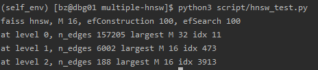
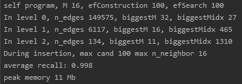

# Hierarchical-Navigable-Small-World
An simple implementation of 

> Malkov, Y. A., & Yashunin, D. A. (2018). Efficient and robust approximate nearest neighbor search using hierarchical navigable small world graphs. IEEE transactions on pattern analysis and machine intelligence, 42(4), 824-836.

Note that:

1. The program do not use any parallel technique and avoid most of pointer technique, so it is easy for learning.
2. For select neighbor algorithm, I only implement the algorithm 4 without extendCandidates and keepPrunedConnections.

## Install

```sh
git clone https://github.com/bianzheng123/Hierarchical-Navigable-Small-World.git
cd Hierarchical-Navigable-Small-World
mkdir build
cd build
cmake ..
make
./hnsw
```

## Experiment

The test dataset is siftsmall(http://corpus-texmex.irisa.fr/). 

I use the faiss for comparison. With the same configuration(M=16, efConstruction=100, efSearch=100), the number of edges at bottom layer is 15k for self-implementation and 16k for faiss. The reason is still unknown.




